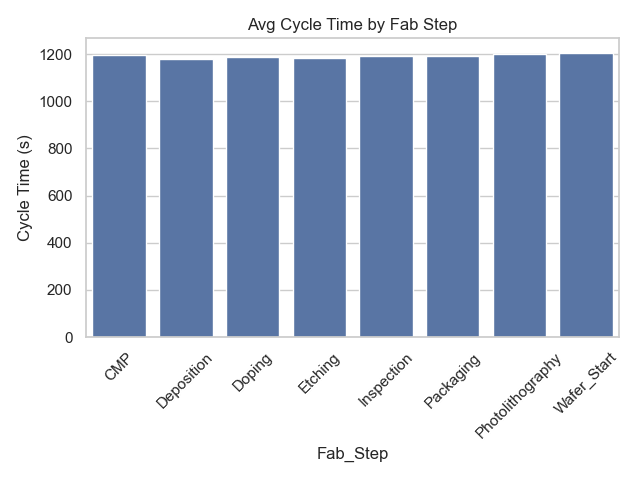

# # 📊 Intel-Inspired Semiconductor Fabrication Analysis - MSE 507 Project

This project applies Lean principles to a simulated semiconductor fabrication facility inspired by Intel’s operations. 
The goal is to analyze core process steps, identify forms of waste, and apply continuous improvement tools to enhance efficiency. A synthetic dataset of 10,000 records was created, including steps like photolithography, etching, doping, and inspection. 
Metrics such as cycle time, queue time, defect rates, and machine status were analyzed.

> 🔄 **Originally completed in December 2022** as a course final project at California State University, Northridge.
>  🛠️ **Updated in February 2025** with simulated data.

>🔍 Source of Inspiration
This project was inspired by the following benchmark dataset and academic paper:

**[A Benchmark Time Series Dataset for Semiconductor Fabrication Manufacturing](https://arxiv.org/abs/2408.09307)**  
Developed by researchers at Arizona State University in collaboration with Intel Corporation, this paper presents a time series dataset that simulates real-world semiconductor fab processes using discrete event simulation. It includes data on equipment performance, defect rates, queue times, and processing steps—making it an ideal reference for Lean Manufacturing system analysis in high-tech environments.

📄 [Read the full paper on arXiv](https://arxiv.org/pdf/2408.09307)

## 📌 Methodology and Dataset

- **Fabrication Steps:** Wafer_Start, Photolithography, Etching, Doping, Deposition, CMP, Inspection, Packaging  
- **Key Fields:**
  - `Cycle_Time_Sec`, `Queue_Time_Sec` (Flow analysis)
  - `Wafer_Yield_Percent`, `Defect_Count` (Quality analysis)
  - `Machine_Status` (Idle, Running, Maintenance, Down)
  - `Operator_ID`, `Equipment_ID`, `Run_Timestamp`

Each record simulates wafer-level operations across different fab tools.

---

## 🔧  Key Lean Thinking Principles Applied

- **Identify Customer Value:** High yield, fast turnaround, and minimal defects.
- **Map the Value Stream:** Visualized time and quality metrics per fab step.
- **Ensure Flow:** Analyzed queue and cycle time to identify bottlenecks.
- **Implement Pull:** Simulated via machine status and queue time as flow indicators.
- **Seek Perfection:** Continuous improvement logic based on data (PDCA, SPC, trend analysis).

---

## 📈 Waste Analysis

- **Queue Time**: Represents wait time (Lean waste #1)
- **Defects**: Indicate quality failure
- **Machine Downtime**: Non-value-adding delay due to maintenance or breakdowns

---

## Pull System Effectiveness

No Pull flag was present, so we used **low queue time** and **high machine uptime** to simulate Pull behavior.

---

## Continuous Improvement

- **PDCA:** Used for feedback and iteration
- **SPC:** To track cycle time and defect trends
- **Time Series Analysis:** Cycle time over time shows process stability

---

## Recommendations

- **Balance Workload at Photolithography**
- **Reduce Machine Downtime**
- **Defect Root Cause Analysis**
- **Implement Real-Time Lot Scheduling**

---

## Conclusion

This dataset shows how Lean Thinking supports better decisions in semiconductor manufacturing. 
Visual analysis reveals waste, bottlenecks, and improvement areas—demonstrating a strong foundation for Lean strategy execution.

---

## 📊 Visual Output Samples

### 🔧 Avg Cycle Time by Fab Step

### 🔧 Avg Queue Time by Fab Step

### 🥧 Machine Status Distribution

### 📈 Wafer Yield Distribution

### 📉 Defect Count Distribution

### 🔥 Correlation Matrix

### 📊 Cycle Time Over Time

### 📌 Queue Time vs Defect Count

---

## 🧪 Dataset Details

- `Intel_Fab_Dataset.csv`  
- Simulated Intel-inspired fab process data  
- 10,000 rows of time-series observations across fab steps  

---

## 🔧 Lean Concepts Explored

- Cycle and Queue Time visualization  
- Machine downtime and yield tracking  
- Pull production simulated via uptime + queue  
- PDCA and continuous improvement strategy  

---

## 📁 Files Included

| File | Description |
|------|-------------|
| `Intel_Fab_Dataset.csv` | Simulated fabrication dataset |
| `analysis.py` | Python script for all visualizations |
| `Intel_Fab_Analysis.ipynb` | Jupyter notebook version |
| `FINAL_REPORT.md` | Full project write-up |
| `.png` files | All visual output images |

---

## 🔗 Live Portfolio Reference

> _Also featured at:_  
> 🌐 [jeanpaul2102.github.io/projects.html](https://jeanpaul2102.github.io/projects.html)

**Project Title:**  
Intel-Inspired Semiconductor Fab | ⚙️ Lean Flow, 📉 Waste Elimination, 📈 Continuous Improvement

--- 
Public

## 👨‍🎓 Author

**Jean Paul Collazo**  
M.S. in Engineering Management | Data Science Candidate  
📧 [jeanpaul.collazo.597@my.csun.edu](mailto:jeanpaul.collazo.597@my.csun.edu)  
🌐 [jeanpaul2102.github.io](https://jeanpaul2102.github.io)
